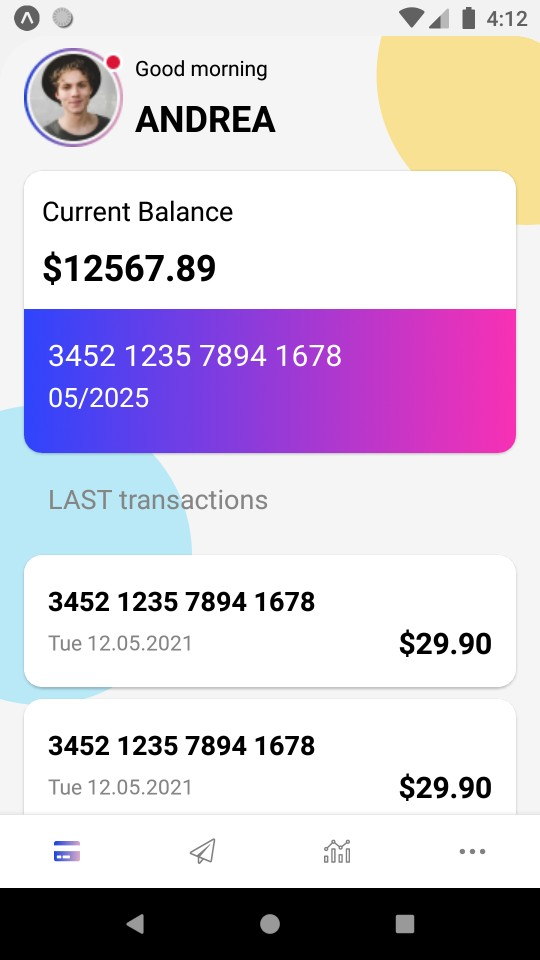
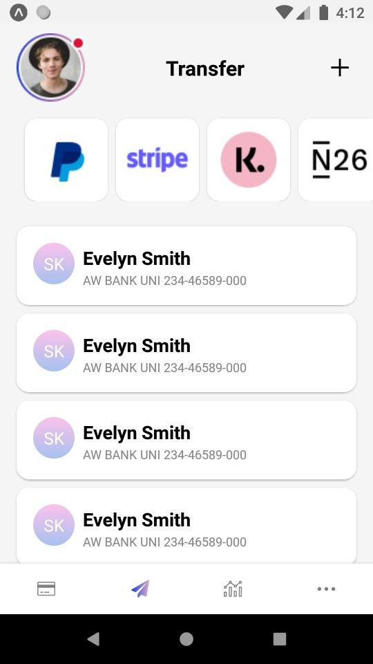
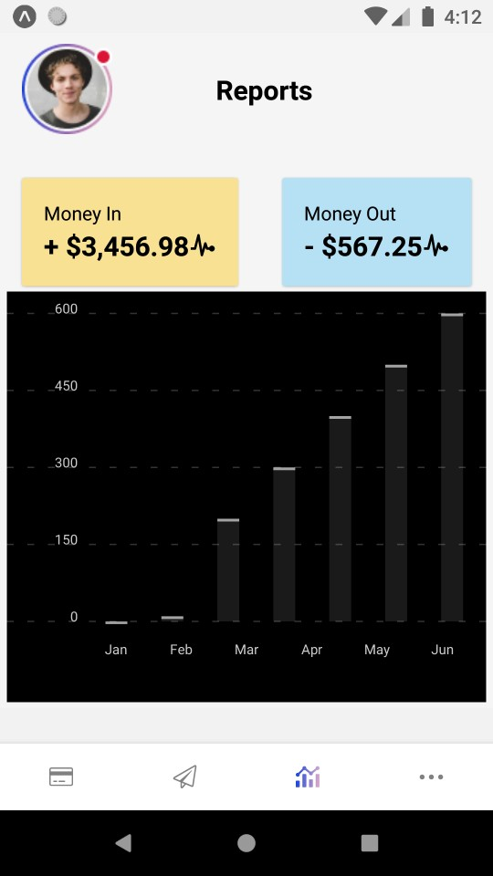

# Task for React Native Developer

## Task 1 : Building a Money Management App with SMS
### Data Integration
#### Objective:

Create a React Native money management application within 24 hours that integrates with SMS
data to track expenses and transactions. This task will evaluate your ability to build a complex
app, work with SMS data, use third-party libraries (Axios, Redux, React Navigation), and design
a user-friendly UI based on a provided Figma design.
Requirements:

1. Set up a new React Native project using the Expo CLI or React Native CLI.
2. Design the app's UI based on the provided Figma design: [Figma Money Management
UI](https://www.figma.com/file/AsvAiubameyt1cXxp8X9ZG/Free-Mobile-UI---Banking-APP-(Com
munity)?type=design&node-id=0-1&mode=design&t=EHi2dAQP5dHS8SHF-0).
- Ensure that the app closely resembles the Figma design in terms of layout, colors, fonts, and
components.
3. Implement SMS data integration:
- Build a feature that allows users to grant the app access to their SMS data.
- Retrieve and parse SMS messages related to financial transactions (e.g., bank notifications).
- Organize and categorize transactions, expenses, and incomes based on SMS data.
4. Use Redux for state management to store and manage transaction data.
- Create actions and reducers to update the state based on SMS data.
- Implement Redux middleware if necessary for handling asynchronous actions.
5. Integrate Axios to fetch additional financial data from a public API (e.g., currency exchange
rates, stock prices)[Optional]
6. Implement navigation using React Navigation.
- Create a navigation structure that allows users to navigate between different sections of your
app, including viewing transactions, bank accounts, graphs, etc.
7. Implement features to categorize expenses, view expense trends over time, and generate
graphs or charts based on financial data.

8. Ensure that the app has error handling for SMS data retrieval, API requests, and provides
clear error messages to the user.
9. Optimize the app's performance for smooth animations and interactions, especially when
displaying graphs and charts.
10. Include unit tests for critical parts of your app, such as Redux actions and reducers.
Bonus (Optional):

- Implement user authentication for data security.
- Enable the user to manually categorize transactions.
- Implement custom animations and transitions.
- Add a feature to export financial reports.
- Ensure cross-platform compatibility and responsive design for both Android and iOS.
Submission and Commit Messages:

- When you start working on the task, commit and push your code with the message "Task
started."
- When you finish the task within the 24-hour limit, commit and push your code with the
message "Task finished."
Evaluation Criteria:

#### Your task will be evaluated based on the following criteria:
- Adherence to the provided Figma design.
- Correct implementation of SMS data integration, Redux, Axios, and React Navigation.
- Code quality, including organization, readability, and maintainability.
- Error handling and user feedback.
- UI/UX design and responsiveness.
- Bonus points for extra features and optimizations.
This coding task is designed as a time-bound challenge to assess your ability to rapidly develop
a feature-rich React Native application. Good luck with your 24-hour challenge!

## Screenshots

## Contact

- Website [infoskillstechnology.com](https://{infoskillstechnology.com})
- GitHub [@skbhati199](https://{github.com/skbhati199})
- Twitter [@skbhati199](https://{twitter.com/skbhati199})

## Support

For support, email
[Email Us](mailto:skbhati199@gmail.com).